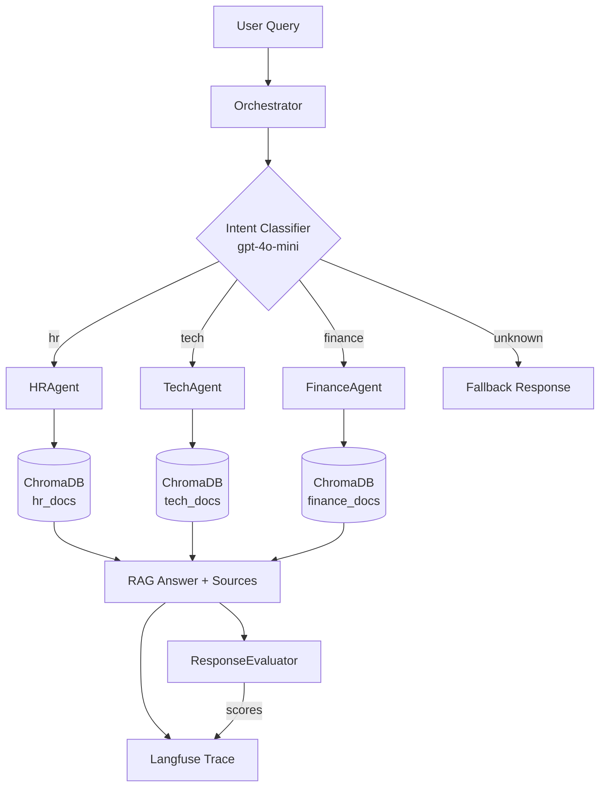

*[Leer en Espanol](README.md)*

# Multi-Agent RAG System with Intelligent Routing

A multi-agent orchestration system that solves the problem of **misrouted customer queries** in enterprise environments. An LLM-powered orchestrator classifies user intent and conditionally routes each query to the correct specialized RAG agent (HR, Tech, or Finance), generating contextually grounded responses from domain-specific documentation. The entire execution path is traced with **Langfuse** for production-grade observability, and an automated **evaluator agent** scores response quality on three dimensions.

Built with **LangChain** for the orchestration framework, **ChromaDB** for vector storage, and **Langfuse** for end-to-end tracing and evaluation.

---

## Table of Contents

1. [Problem Statement](#problem-statement)
2. [Architecture](#architecture)
3. [Prerequisites](#prerequisites)
4. [Installation](#installation)
5. [How to Run](#how-to-run)
6. [Project Structure](#project-structure)
7. [How It Works](#how-it-works)
8. [Technical Decisions](#technical-decisions)
9. [Usage Examples](#usage-examples)
10. [Evaluator Agent (Bonus)](#evaluator-agent-bonus)
11. [Langfuse Observability](#langfuse-observability)
12. [Test Queries and Accuracy](#test-queries-and-accuracy)
13. [Known Limitations](#known-limitations)
14. [Future Improvements](#future-improvements)

---

## Problem Statement

A mid-size SaaS company receives customer queries across multiple departments (HR, IT Support, Finance). The support team is overwhelmed because tickets are frequently misrouted: HR questions end up in IT, financial queries reach the legal team, etc. This system solves that problem by:

1. **Automatically classifying** the intent of each incoming query using an LLM
2. **Routing it** to a specialized RAG agent that has access only to its domain's documentation
3. **Generating grounded responses** based on actual company documents (not hallucinated)
4. **Tracing the full execution path** so misclassifications and retrieval failures can be debugged
5. **Evaluating response quality** automatically before it reaches the customer

---

## Architecture

### High-Level Flow

```
User Query
    |
    v
┌──────────────────────┐
│     Orchestrator      │
│  (classify_intent)    │──── Langfuse Trace: intent-classification
│                       │
│  intent: hr|tech|     │
│  finance|unknown      │
└──────────┬───────────┘
           |
     ┌─────┼─────┐
     v     v     v
  ┌─────┐┌─────┐┌───────┐
  │ HR  ││Tech ││Finance│
  │Agent││Agent││ Agent │──── Langfuse Trace: rag-retrieval
  └──┬──┘└──┬──┘└───┬───┘
     |     |       |
     v     v       v
  ┌─────┐┌─────┐┌───────┐
  │hr   ││tech ││finance│
  │docs ││docs ││ docs  │     ChromaDB (3 collections)
  └���────┘└─────┘└───────┘
           |
           v
    RAG Response
    {answer, sources, intent, confidence}
           |
           v
┌──────────────────────┐
│  ResponseEvaluator   │      LLM Judge (bonus)
│  relevance: 1-10     │
│  completeness: 1-10  │──── Langfuse Scores API
│  accuracy: 1-10      │
└──────────────────────┘
```

### Mermaid Diagram



---

## Prerequisites

| Requirement | Details |
|-------------|---------|
| **Python** | 3.11 or higher |
| **OpenAI API key** | Required for embeddings (text-embedding-ada-002) and LLM inference (gpt-4o-mini) |
| **Langfuse account** | Optional but recommended. Free tier at [cloud.langfuse.com](https://cloud.langfuse.com). Required for tracing and the evaluator agent |
| **Jupyter** | Included in dependencies. Any Jupyter-compatible environment works (VS Code, JupyterLab, classic Notebook) |

---

## Installation

### Step 1: Clone the repository

```bash
git clone https://github.com/ludwingra/multi-agent-rag.git
cd multi-agent-rag
```

### Step 2: Create a virtual environment

```bash
python -m venv .venv
source .venv/bin/activate        # macOS / Linux
# .venv\Scripts\activate         # Windows
```

### Step 3: Install dependencies

```bash
pip install -r requirements.txt
```

This installs 12 packages: `langchain`, `langchain-openai`, `langchain-community`, `langchain-chroma`, `langfuse`, `openai`, `chromadb`, `tiktoken`, `python-dotenv`, `jupyter`, `ipykernel`, `pydantic-settings`.

### Step 4: Configure environment variables

```bash
cp .env.example .env
```

Edit `.env` with your credentials:

```dotenv
OPENAI_API_KEY=sk-...                          # REQUIRED
LANGFUSE_PUBLIC_KEY=pk-lf-...                  # Optional (for tracing)
LANGFUSE_SECRET_KEY=sk-lf-...                  # Optional (for tracing)
LANGFUSE_BASE_URL=https://cloud.langfuse.com   # Optional (for tracing)
```

> **Note:** If Langfuse credentials are not provided, the system still runs normally. Tracing calls become no-ops and the evaluator agent will not send scores.

### Step 5: Verify the installation

```bash
python -c "from src.config import Settings; Settings(); print('OK')"
```

If this prints `OK`, the environment is correctly configured.

---

## How to Run

### Option A: Jupyter Notebook (recommended)

The main entry point is the notebook. Open it with:

```bash
jupyter notebook notebooks/multi_agent_system.ipynb
# or
jupyter lab notebooks/multi_agent_system.ipynb
```

**Run all cells in order.** The notebook is organized in 6 sections:

| Section | What it does | Estimated time |
|---------|-------------|----------------|
| **1. Setup e Imports** | Loads environment variables, verifies API keys, shows library versions | Instant |
| **2. Carga de Documentos y Vector Stores** | Reads 60 markdown documents, splits into chunks, creates/loads 3 ChromaDB collections | ~30-60s first run, <1s after |
| **3. Definicion de Agentes RAG** | Instantiates HRAgent, TechAgent, FinanceAgent and tests each one individually | ~10s |
| **4. Orquestador y Enrutamiento Inteligente** | Demonstrates intent classification and full routing pipeline | ~15s |
| **5. Pruebas y Ejemplos — Batch Testing** | Runs all 16 test queries, measures classification accuracy, shows results table | ~2-3 min |
| **6. Integracion con Langfuse — Observabilidad** | Verifies Langfuse connection, executes traced query, explains dashboard navigation | ~5s |

**First run note:** Section 2 calls the OpenAI Embeddings API to vectorize all 60 documents. This takes 30-60 seconds. Subsequent runs load the persisted vector store from `./chroma_db/` instantly.

**Estimated API cost:** A full notebook run (~20 LLM calls) consumes approximately 20-30K tokens of gpt-4o-mini (~$0.01-0.02 USD).

### Option B: Individual module smoke tests

Each module can be tested independently from the command line:

```bash
# Test document loading (no API calls)
python -m src.document_loader

# Test vector store creation (requires OPENAI_API_KEY)
python -m src.vector_store

# Test agent initialization (requires OPENAI_API_KEY + populated ChromaDB)
python -m src.agents
```

### Option C: Python interactive / script

```python
from dotenv import load_dotenv
load_dotenv()

from src.agents import Orchestrator

orch = Orchestrator()
result = orch.route("How do I request vacation days?")
print(result["intent"])    # "hr"
print(result["answer"])    # Grounded response from HR documents
```

---

## Project Structure

```
multi-agent-rag/
│
├── .env.example                  # Environment variable template (5 variables)
├── .gitignore                    # Excludes .env, chroma_db/, __pycache__/, etc.
├── requirements.txt              # 12 Python dependencies
├── README.md                     # Spanish version (primary)
├── README.en.md                  # English version
│
├── data/
│   ├── hr_docs/                  # 20 synthetic HR policy documents
│   ├── tech_docs/                # 20 synthetic IT/Tech support documents
│   ├── finance_docs/             # 20 synthetic Finance policy documents
│   └── test_queries.json         # 16 labeled test queries with expected intents
│
├── notebooks/
│   └── multi_agent_system.ipynb  # Main notebook — 6 sections, 27 cells
│
└── src/
    ├── __init__.py
    ├── config.py                 # Pydantic Settings — env var loading and validation
    ├── tracing.py                # Langfuse client factory and callback handler
    ├── document_loader.py        # DocumentLoader — reads .md files, splits into chunks
    ├── vector_store.py           # VectorStoreManager — ChromaDB CRUD and retriever factory
    ├── evaluator.py              # ResponseEvaluator — automated LLM judge (bonus)
    └── agents/
        ├── __init__.py           # Public exports: HRAgent, TechAgent, FinanceAgent, Orchestrator
        ├── __main__.py           # Smoke test entry point
        ├── base_agent.py         # BaseRAGAgent — abstract base class with retrieval chain
        ├── hr_agent.py           # HRAgent — HR domain specialist
        ├── tech_agent.py         # TechAgent — IT/Tech domain specialist
        ├── finance_agent.py      # FinanceAgent — Finance domain specialist
        └── orchestrator.py       # Orchestrator — intent classification + conditional routing + tracing
```

### Knowledge Base (data/)

60 synthetic markdown documents for a fictional company called **TechNova Solutions** (SaaS B2B, ~500 employees). Each document is 450-900 words and covers realistic corporate policies, procedures, and guidelines. Cross-references between documents provide coherence across the knowledge base.

| Domain | Files | Chunks | Topics |
|--------|-------|--------|--------|
| `hr_docs/` | 20 | ~239 | Vacation, benefits, onboarding, performance reviews, compensation, code of conduct |
| `tech_docs/` | 20 | ~264 | VPN setup, incident response, GitHub access, CI/CD, security, laptop setup |
| `finance_docs/` | 20 | ~242 | Expense reimbursement, travel policy, invoices, budgets, corporate cards, tax compliance |

### Test Queries (data/test_queries.json)

16 labeled queries covering all domains and difficulty levels:

| Category | Count | Examples |
|----------|-------|---------|
| HR | 4 | Vacation policy, health insurance, onboarding, performance reviews |
| Tech | 4 | VPN setup, GitHub access, production incidents, laptop configuration |
| Finance | 5 | Expense reports, travel allowance, invoices, purchase requisitions, corporate card |
| Unknown | 1 | Weather forecast (out of domain) |
| Hard/ambiguous | 2 | Cross-domain queries that test classification edge cases |

---

## How It Works

### Step 1 — Intent Classification

When a query arrives, the `Orchestrator` sends it to `classify_intent()` which uses `gpt-4o-mini` with a structured prompt. The LLM returns JSON:

```json
{"intent": "tech", "confidence": 0.95, "reasoning": "VPN configuration is an IT topic"}
```

Valid intents: `hr`, `tech`, `finance`, `unknown`. Queries classified as `unknown` receive a generic fallback response without invoking any RAG agent.

### Step 2 — Conditional Routing

Based on the classified intent, the Orchestrator dispatches the query to the corresponding specialized agent (`HRAgent`, `TechAgent`, or `FinanceAgent`).

### Step 3 — RAG Retrieval and Response Generation

The selected agent executes a retrieval chain:
1. The **retriever** searches ChromaDB for the 4 most similar chunks in its domain collection
2. The chunks are injected as `{context}` into the agent's domain-specific system prompt
3. `gpt-4o-mini` generates a response **grounded only in the retrieved documents**

### Step 4 — Langfuse Tracing

Every query creates a parent trace with two child spans:
```
Trace: user-query
  ├── Span: intent-classification  (input → {intent, confidence, reasoning})
  ���── Span: rag-retrieval          (query + intent → {answer, sources})
```

### Step 5 — Automated Evaluation (bonus)

The `ResponseEvaluator` sends the response to another LLM call that scores it on three dimensions (1-10): **relevance**, **completeness**, and **accuracy**. Scores are sent to Langfuse via the Scores API, enabling quality monitoring dashboards.

---

## Technical Decisions

### 1. LangChain as the orchestration framework

LangChain provides production-grade abstractions for chain composition (`prompt | llm`), retrieval chains (`create_retrieval_chain`), and callback-based tracing. The modular package structure (`langchain-openai`, `langchain-chroma`, `langchain-core`) enables clean separation of concerns — the LLM, vector store, and chain logic are independently swappable without refactoring. This follows industry standards for maintainability and reduces vendor lock-in.

### 2. ChromaDB for vector storage

ChromaDB was chosen as a lightweight, embedded vector database that persists to a local directory (`./chroma_db/`) with zero external infrastructure. The initialization is idempotent: if collections exist on disk they are loaded; otherwise they are created from source documents. This makes the project **fully self-contained** — no Pinecone, Weaviate, or cloud service is required to run it.

### 3. gpt-4o-mini as the inference model

`gpt-4o-mini` provides a strong balance of quality and cost. Both the intent classifier and RAG agents share the same model, simplifying configuration. The model name is configurable via the `MODEL_NAME` environment variable, so upgrading to `gpt-4o` requires zero code changes. For 16 batch queries, the total cost is approximately $0.01-0.02 USD.

### 4. RecursiveCharacterTextSplitter (chunk_size=500, overlap=50)

Small chunks (500 characters) improve retrieval precision — each chunk contains a focused piece of information rather than mixing multiple topics. An overlap of 50 characters preserves sentence continuity at chunk boundaries. These values are tuned for the short-to-medium length corporate policy documents in the knowledge base.

### 5. LLM-based intent routing

The Orchestrator uses a dedicated LLM classification call with a structured prompt that returns JSON (`intent`, `confidence`, `reasoning`). This approach handles paraphrasing, ambiguous queries, and cross-domain questions more robustly than keyword matching or rule-based classifiers. The prompt includes disambiguation rules for edge cases (e.g., "laptop setup during onboarding" routes to HR, not Tech).

### 6. Langfuse for end-to-end observability

Each query creates a hierarchical trace in Langfuse with child spans for classification and retrieval. This enables:
- **Debugging misclassifications** by inspecting the classification span's input/output
- **Analyzing retrieval failures** by reviewing which chunks were returned
- **Monitoring response quality** via automated evaluation scores
- **Production incident response** by filtering traces by user, intent, or confidence level

---

## Usage Examples

### HR Query

```python
from src.agents.orchestrator import Orchestrator

orch = Orchestrator()
result = orch.route("How many vacation days do I get per year?")
```

Response:
```json
{
  "query": "How many vacation days do I get per year?",
  "intent": "hr",
  "confidence": 0.95,
  "reasoning": "Query asks about PTO/vacation policy, which falls under HR.",
  "answer": "TechNova Solutions provides 15 PTO days per year for full-time employees...",
  "sources": ["vacation-policy.md", "benefits-overview.md"],
  "agent": "hr_agent"
}
```

### Tech Query

```python
result = orch.route("How do I connect to the company VPN from home?")
```

Response:
```json
{
  "query": "How do I connect to the company VPN from home?",
  "intent": "tech",
  "confidence": 0.95,
  "reasoning": "VPN configuration is an IT infrastructure topic.",
  "answer": "To connect to TechNova's VPN, download the GlobalProtect client...",
  "sources": ["vpn-setup-guide.md"],
  "agent": "tech_agent"
}
```

### Finance Query

```python
result = orch.route("How do I submit an expense for a client dinner?")
```

Response:
```json
{
  "query": "How do I submit an expense for a client dinner?",
  "intent": "finance",
  "confidence": 0.95,
  "reasoning": "Expense reimbursement is a finance department topic.",
  "answer": "Submit your expense report within 30 calendar days of the expense...",
  "sources": ["expense-reimbursement.md", "corporate-card-policy.md"],
  "agent": "finance_agent"
}
```

### Batch Routing with Accuracy

```python
import json

with open("data/test_queries.json") as f:
    queries = json.load(f)["test_queries"]

batch = orch.batch_route(queries)
print(f"Accuracy: {batch['accuracy']:.1%}")  # ~93-100%
```

---

## Evaluator Agent (Bonus)

The `ResponseEvaluator` in `src/evaluator.py` implements an automated LLM judge that scores each RAG response on three dimensions:

| Dimension | Scale | What it measures |
|-----------|-------|-----------------|
| **Relevance** | 1-10 | Does the answer directly address the user's question? |
| **Completeness** | 1-10 | Does it cover all important aspects? |
| **Accuracy** | 1-10 | Is it grounded in the source documents (not hallucinated)? |

### How it works

1. The evaluator receives the original query, the agent's response, the classified intent, and the source documents
2. It sends a structured prompt to `gpt-4o-mini` asking for JSON scores
3. It parses the scores and sends them to Langfuse via `langfuse.score()` — four scores per response (relevance, completeness, accuracy, overall)
4. Scores appear in the Langfuse dashboard attached to each trace

### Usage

```python
from evaluator import ResponseEvaluator
from src.tracing import get_langfuse_client
from src.config import Settings
from langchain_openai import ChatOpenAI

settings = Settings()
langfuse = get_langfuse_client()
llm = ChatOpenAI(model=settings.MODEL_NAME, api_key=settings.OPENAI_API_KEY)

evaluator = ResponseEvaluator(langfuse_client=langfuse, llm=llm)

# Evaluate a single response
evaluation = evaluator.evaluate_response(
    trace_id="...",
    query="How many vacation days do I get?",
    answer="TechNova provides 15 PTO days...",
    intent="hr",
    sources=["vacation-policy.md"]
)
# → {"relevance": 9, "completeness": 8, "accuracy": 9, "overall": 8.67, "summary": "..."}

# Evaluate a batch and generate a report
evaluations = evaluator.evaluate_batch(batch_results["results"])
print(evaluator.generate_report(evaluations))
```

---

## Langfuse Observability

### What is traced

Every call to `orchestrator.route()` creates a hierarchical trace:

```
Trace: user-query
│
├── Span: intent-classification
│     input:  "How do I request time off?"
│     output: {"intent": "hr", "confidence": 0.95, "reasoning": "..."}
│     model:  gpt-4o-mini
│     tokens: prompt_tokens + completion_tokens
│
└── Span: rag-retrieval
      input:  {"query": "...", "intent": "hr"}
      output: {"answer": "...", "sources": ["vacation-policy.md"]}
      model:  gpt-4o-mini
      chunks: documents retrieved from ChromaDB
```

### How to explore traces

1. Go to your Langfuse dashboard at `https://cloud.langfuse.com`
2. Navigate to **Tracing > Traces**
3. Filter by trace name `user-query` or by `user_id`
4. Click any trace to inspect the full span tree, latencies, token usage, and inputs/outputs
5. Check the **Scores** tab to see evaluation metrics (if the evaluator was run)

### Configuring Langfuse

1. Create a free account at [cloud.langfuse.com](https://cloud.langfuse.com)
2. Create a new project
3. Go to **Settings > API Keys > Create new API keys**
4. Copy the Public Key (`pk-lf-...`) and Secret Key (`sk-lf-...`) to your `.env` file

---

## Test Queries and Accuracy

The system is tested with 16 labeled queries in `data/test_queries.json`. Each query has an `expected_intent` and a `difficulty` level.

### Expected results

- **Easy queries** (single-domain, clear intent): ~100% accuracy
- **Medium queries** (specific but unambiguous): ~100% accuracy
- **Hard queries** (cross-domain, ambiguous): ~85-100% accuracy depending on prompt tuning

The classification prompt includes disambiguation rules for common edge cases:
- "Set up my new laptop" during onboarding context routes to `hr` (not `tech`)
- "Tax implications of stock options" routes to `hr` (employee benefit, not accounting)

Overall expected accuracy: **87-100%** across all 16 queries.

---

## Known Limitations

- **No streaming** — responses are returned in a single blocking call. There is no token-by-token streaming to a UI.
- **No conversation memory** — each `orchestrator.route()` call is stateless. Follow-up questions that depend on prior context will not resolve correctly.
- **Synthetic documents only** — the knowledge base contains 60 auto-generated markdown files for a fictional company. Answers reflect TechNova Solutions policies, not real company procedures.
- **Single model for all tasks** — `gpt-4o-mini` handles both classification and RAG. Complex queries may benefit from a more capable model.
- **No authentication** — the orchestrator does not enforce per-user permissions. Any caller can query any domain.
- **English-only knowledge base** — the source documents are in English. Queries in other languages may produce lower-quality results.

---

## Future Improvements

- **Streaming responses** — integrate LangChain's streaming interface for real-time token output
- **Conversation memory** — add session-based memory so agents can handle follow-up questions
- **Real document ingestion** — replace synthetic data with a pipeline for PDF, DOCX, and Confluence pages
- **Model routing by complexity** — use `gpt-4o-mini` for simple queries and `gpt-4o` for complex ones
- **Web UI** — wrap the orchestrator in a FastAPI backend with a Streamlit or React frontend
- **Additional domains** — add Legal, Sales, or Product agents with their own knowledge bases
- **Confidence-based fallback** — route low-confidence classifications to a human reviewer instead of the best-guess agent

---

*Built as part of the Henry IA Engineer program — Module 3: Multi-Agent Systems.*
