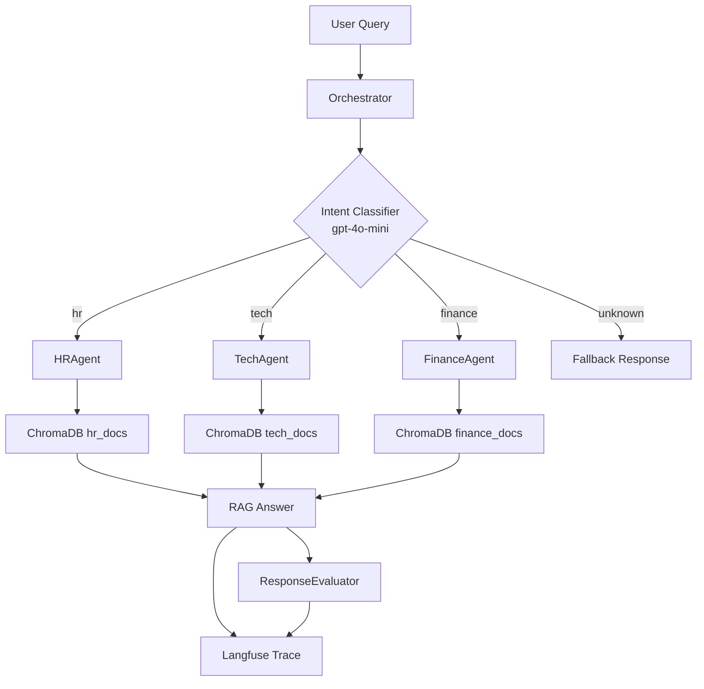

# Multi-Agent RAG System

A production-ready Retrieval-Augmented Generation (RAG) system built for **TechNova Solutions**, a fictional company used as a knowledge-base scenario. The system routes employee queries across three specialized domains — **HR**, **Technology**, and **Finance** — by combining LLM-based intent classification with per-domain retrieval chains. Full observability is provided through Langfuse tracing and an automated LLM-judge evaluator.

---

## Table of Contents

1. [Architecture](#architecture)
2. [Prerequisites](#prerequisites)
3. [Installation](#installation)
4. [How to Run](#how-to-run)
5. [Project Structure](#project-structure)
6. [Technical Decisions](#technical-decisions)
7. [Usage Examples](#usage-examples)
8. [Known Limitations](#known-limitations)
9. [Future Improvements](#future-improvements)

---

## Architecture

```
Documents (Markdown)
       |
       v
 DocumentLoader          <-- loads & splits markdown files
       |
       v
RecursiveCharacterTextSplitter  (chunk_size=500, overlap=50)
       |
       v
   ChromaDB              <-- local vector store, one collection per domain
  /    |    \
hr   tech  finance       <-- three independent retrievers
  \    |    /
   v   v   v
Domain Agents            <-- HRAgent | TechAgent | FinanceAgent
       ^
       |
  Orchestrator           <-- LLM intent classifier → routes to the right agent
       |
       v
   Response              <-- answer + sources + trace metadata
       |
       v
ResponseEvaluator        <-- optional LLM judge → scores sent to Langfuse
```



---

## Prerequisites

- **Python 3.11+**
- **OpenAI API key** — required for embeddings and LLM inference
- **Langfuse account** (optional) — required only for distributed tracing and evaluation scores. Sign up at [cloud.langfuse.com](https://cloud.langfuse.com) for free.
- **Jupyter** — included in `requirements.txt`; any Jupyter-compatible environment works (VS Code, JupyterLab, classic Notebook)

---

## Installation

```bash
# 1. Clone the repository
git clone <repo-url>
cd proyecto

# 2. Create and activate a virtual environment
python -m venv .venv
source .venv/bin/activate        # Linux / macOS
# .venv\Scripts\activate         # Windows

# 3. Install dependencies
pip install -r requirements.txt

# 4. Configure environment variables
cp .env.example .env
```

Edit `.env` and fill in your credentials:

```dotenv
OPENAI_API_KEY=sk-...            # required
LANGFUSE_PUBLIC_KEY=pk-lf-...   # optional (tracing)
LANGFUSE_SECRET_KEY=sk-lf-...   # optional (tracing)
LANGFUSE_HOST=https://cloud.langfuse.com
```

> If you skip Langfuse credentials the system still runs; tracing calls are no-ops.

---

## How to Run

The main entry point is the Jupyter notebook:

```bash
jupyter notebook notebooks/multi_agent_system.ipynb
# or
jupyter lab notebooks/multi_agent_system.ipynb
```

Run cells in order. The notebook is divided into six sections:

| Section | Content |
|---------|---------|
| 1 | Environment setup — imports, settings, Langfuse handler |
| 2 | Document loading — reads markdown files from `data/` and splits them |
| 3 | Vector store initialization — creates or loads ChromaDB collections |
| 4 | Agent and orchestrator initialization — wires retrievers to domain agents |
| 5 | Batch testing — runs all 16 queries from `data/test_queries.json` and reports routing accuracy |
| 6 | Observability — displays Langfuse trace URLs; optionally runs `ResponseEvaluator` to score responses |

**First run only:** ChromaDB will ingest and embed all documents (~60 markdown files). This takes roughly 30–60 seconds depending on network latency to the OpenAI embeddings API. Subsequent runs load the persisted store from `./chroma_db/` instantly.

**Evaluator (optional):** `evaluator.py` contains `ResponseEvaluator`. Section 6 of the notebook shows how to instantiate it and run `evaluate_batch()` against the batch results. Scores appear in your Langfuse dashboard under the trace for each query.

---

## Project Structure

```
.
├── .env.example              # Environment variable template (4 vars)
├── .gitignore
├── requirements.txt          # 12 Python dependencies
├── evaluator.py              # ResponseEvaluator — LLM judge with Langfuse scoring
├── data/
│   ├── hr_docs/              # 20 synthetic HR documents (TechNova Solutions)
│   ├── tech_docs/            # 20 synthetic IT/Tech documents
│   ├── finance_docs/         # 20 synthetic Finance documents
│   └── test_queries.json     # 16 labeled test queries with expected intents
├── notebooks/
│   └── multi_agent_system.ipynb  # 6-section notebook — main entry point
└── src/
    ├── __init__.py
    ├── config.py             # Pydantic Settings — loads env vars with validation
    ├── tracing.py            # Langfuse integration — handler factory and client
    ├── document_loader.py    # DocumentLoader — reads and splits markdown documents
    ├── vector_store.py       # VectorStoreManager — ChromaDB lifecycle management
    └── agents/
        ├── __init__.py
        ├── __main__.py       # Smoke test — validates agent initialization
        ├── base_agent.py     # BaseRAGAgent — abstract base with retrieval chain
        ├── hr_agent.py       # HRAgent — HR domain specialist
        ├── tech_agent.py     # TechAgent — IT/Tech domain specialist
        ├── finance_agent.py  # FinanceAgent — Finance domain specialist
        └── orchestrator.py   # Orchestrator — intent classification, routing, tracing
```

---

## Technical Decisions

### 1. LangChain 1.2.x as the orchestration framework

LangChain was chosen for its modular chain composition API (`prompt | llm`) and its first-class retrieval chain abstractions. The `langchain-openai`, `langchain-chroma`, and `langchain-core` packages provide clean separation of concerns: the LLM, the vector store, and the chain logic are independently swappable. This reduces vendor lock-in and simplifies unit testing of individual components.

### 2. ChromaDB for vector storage

ChromaDB is a lightweight, embedded vector database that persists to a local directory (`./chroma_db/`) with no external infrastructure. The store is initialized idempotently: if the collection already exists it is loaded; otherwise it is created from the markdown documents. This design makes the project fully self-contained — no Pinecone, Weaviate, or other managed service is required to run it.

### 3. gpt-4o-mini as the inference model

`gpt-4o-mini` provides a strong balance of quality and cost for this use case. Both the intent classifier and the RAG response chains use the same model, which simplifies configuration and keeps token costs low during batch evaluation over 16+ queries. The model name is configurable via the `MODEL_NAME` environment variable, so swapping to `gpt-4o` requires no code changes.

### 4. RecursiveCharacterTextSplitter with chunk_size=500, overlap=50

Small chunks (500 characters) improve retrieval precision: each chunk contains a focused piece of information rather than mixing multiple topics. An overlap of 50 characters preserves sentence continuity at chunk boundaries, reducing the risk of splitting a key sentence across two chunks that are retrieved independently.

### 5. LLM-based intent routing (no keyword matching)

The Orchestrator uses a dedicated `gpt-4o-mini` classification call with a structured prompt that returns JSON (`intent`, `confidence`, `reasoning`). This approach handles paraphrasing, ambiguous queries, and cross-domain questions more robustly than keyword matching. Confidence thresholds (< 0.5) trigger a low-confidence warning attached to the Langfuse span for post-hoc analysis.

### 6. Langfuse for end-to-end observability

Each query creates a parent Langfuse trace with two child spans: `intent-classification` and `rag-retrieval`. The `ResponseEvaluator` then sends numeric scores (`relevance`, `completeness`, `accuracy`, `overall`, each 1–10) back to the same trace via the Scores API. This makes it possible to monitor routing accuracy and response quality in a persistent dashboard without modifying application code.

---

## Usage Examples

### HR query

```python
from src.agents.orchestrator import Orchestrator

orchestrator = Orchestrator()
result = orchestrator.route("How many vacation days do I get per year?")
print(result)
```

```json
{
  "query": "How many vacation days do I get per year?",
  "intent": "hr",
  "confidence": 0.98,
  "reasoning": "Query asks about PTO policy, which falls under HR.",
  "answer": "TechNova Solutions provides 15 PTO days per year for full-time employees...",
  "sources": ["data/hr_docs/pto_policy.md"],
  "agent": "HRAgent"
}
```

### Tech query

```python
result = orchestrator.route("How do I connect to the company VPN from home?")
```

```json
{
  "query": "How do I connect to the company VPN from home?",
  "intent": "tech",
  "confidence": 0.97,
  "reasoning": "Query involves VPN configuration, classified as tech.",
  "answer": "To connect to TechNova's VPN, download the GlobalProtect client...",
  "sources": ["data/tech_docs/vpn_setup.md"],
  "agent": "TechAgent"
}
```

### Finance query

```python
result = orchestrator.route("How do I submit an expense for a client dinner?")
```

```json
{
  "query": "How do I submit an expense for a client dinner?",
  "intent": "finance",
  "confidence": 0.96,
  "reasoning": "Expense reimbursement falls under Finance policies.",
  "answer": "Submit your expense through the Concur portal within 30 days...",
  "sources": ["data/finance_docs/expense_policy.md"],
  "agent": "FinanceAgent"
}
```

---

## Known Limitations

- **No streaming** — responses are returned in a single blocking call. There is no token-by-token streaming to a UI or terminal.
- **No conversation memory** — each call to `orchestrator.route()` is stateless. Follow-up questions that depend on prior context will not resolve correctly.
- **Synthetic documents only** — the knowledge base contains 60 auto-generated markdown files. Answers reflect fictional TechNova policies and should not be used as a reference for real company procedures.
- **Single model for all tasks** — the same `gpt-4o-mini` model handles both the intent classifier and domain-specific RAG responses. Complex financial or technical questions may benefit from a more capable model (e.g., `gpt-4o`).
- **No authentication or access control** — the orchestrator does not enforce per-user permissions. Any caller can query any domain.

---

## Future Improvements

- **Streaming responses** — integrate LangChain's streaming interface and surface token-by-token output to a web UI or CLI for a more responsive user experience.
- **Conversation memory** — add a `ConversationBufferMemory` or external session store so agents can resolve follow-up questions that reference earlier turns.
- **Real document ingestion** — replace the synthetic dataset with a pipeline that ingests PDF, DOCX, and Confluence pages from an actual company knowledge base, with incremental updates when documents change.
- **Model routing by complexity** — route simple factual queries to `gpt-4o-mini` and complex multi-step questions to `gpt-4o` (or `o3-mini` for reasoning-heavy tasks) to optimize cost vs. quality dynamically.
- **Web UI** — wrap the orchestrator in a FastAPI backend with a React or Streamlit frontend so non-technical users can interact with the system through a chat interface.

---

*Built as part of the Henry IA Engineer program — Module 3: Multi-Agent Systems.*
