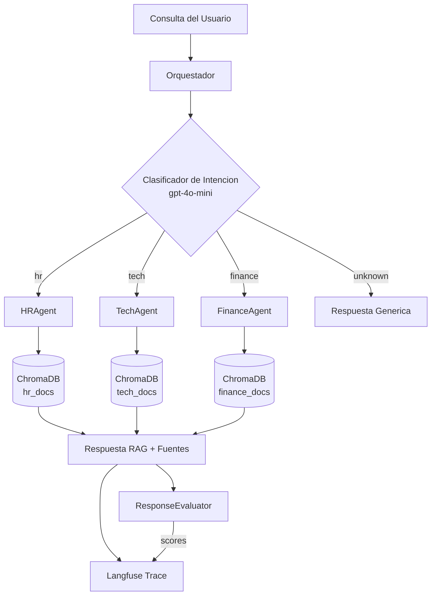

*[Read in English](README.en.md)*

# Sistema Multi-Agente RAG con Enrutamiento Inteligente

Sistema de orquestacion multi-agente que resuelve el problema de **consultas mal enrutadas** en entornos empresariales. Un orquestador potenciado por LLM clasifica la intencion del usuario y enruta condicionalmente cada consulta al agente RAG especializado correcto (HR, Tech o Finance), generando respuestas fundamentadas en la documentacion de cada dominio. Todo el flujo de ejecucion queda trazado con **Langfuse** para observabilidad de grado productivo, y un **agente evaluador** automatizado puntua la calidad de cada respuesta en tres dimensiones.

Construido con **LangChain** como framework de orquestacion, **ChromaDB** para almacenamiento vectorial, y **Langfuse** para trazabilidad y evaluacion de extremo a extremo.

---

## Tabla de Contenidos

1. [Problema que Resuelve](#problema-que-resuelve)
2. [Arquitectura](#arquitectura)
3. [Prerrequisitos](#prerrequisitos)
4. [Instalacion](#instalacion)
5. [Como Ejecutar](#como-ejecutar)
6. [Estructura del Proyecto](#estructura-del-proyecto)
7. [Como Funciona](#como-funciona)
8. [Decisiones Tecnicas](#decisiones-tecnicas)
9. [Ejemplos de Uso](#ejemplos-de-uso)
10. [Agente Evaluador (Bonus)](#agente-evaluador-bonus)
11. [Observabilidad con Langfuse](#observabilidad-con-langfuse)
12. [Queries de Prueba y Precision](#queries-de-prueba-y-precision)
13. [Limitaciones Conocidas](#limitaciones-conocidas)
14. [Mejoras Futuras](#mejoras-futuras)

---

## Problema que Resuelve

Una empresa SaaS mediana recibe consultas de clientes a traves de multiples areas (HR, Soporte IT, Finanzas). El equipo de soporte esta desbordado porque los tickets se enrutan mal: preguntas de HR terminan en IT, consultas financieras llegan al equipo equivocado. Este sistema resuelve ese problema:

1. **Clasifica automaticamente** la intencion de cada consulta entrante usando un LLM
2. **La enruta condicionalmente** al agente RAG especializado que tiene acceso unicamente a la documentacion de su dominio
3. **Genera respuestas fundamentadas** en documentos reales de la empresa (sin alucinaciones)
4. **Traza el flujo de ejecucion completo** para que las clasificaciones erroneas y fallos de retrieval puedan depurarse
5. **Evalua la calidad de las respuestas** automaticamente antes de que lleguen al cliente

---

## Arquitectura

### Flujo General

```
Consulta del Usuario
        |
        v
┌──────────────────────────┐
│      Orquestador         │
│   (classify_intent)      │──── Langfuse Trace: intent-classification
│                          │
│   intent: hr | tech |    │
│   finance | unknown      │
└────────────┬─────────────┘
             |
       ┌─────┼─────┐
       v     v     v
    ┌─────┐┌─────┐┌───────┐
    │ HR  ││Tech ││Finance│
    │Agent││Agent││ Agent │──── Langfuse Trace: rag-retrieval
    └──┬──┘└──┬──┘└───┬───┘
       |     |       |
       v     v       v
    ┌─────┐┌─────┐┌───────┐
    │hr   ││tech ││finance│
    │docs ││docs ││ docs  │     ChromaDB (3 colecciones)
    └─────┘└─────┘└───────┘
             |
             v
      Respuesta RAG
      {answer, sources, intent, confidence}
             |
             v
┌──────────────────────────┐
│   ResponseEvaluator      │      LLM Judge (bonus)
│   relevance: 1-10        │
│   completeness: 1-10     │──── Langfuse Scores API
│   accuracy: 1-10         │
└──────────────────────────┘
```

### Diagrama Mermaid



---

## Prerrequisitos

| Requisito | Detalle |
|-----------|---------|
| **Python** | 3.11 o superior |
| **OpenAI API key** | Requerida para embeddings (text-embedding-ada-002) e inferencia LLM (gpt-4o-mini) |
| **Cuenta Langfuse** | Opcional pero recomendada. Tier gratuito en [cloud.langfuse.com](https://cloud.langfuse.com). Necesaria para trazabilidad y el agente evaluador |
| **Jupyter** | Incluido en las dependencias. Cualquier entorno compatible funciona (VS Code, JupyterLab, Notebook clasico) |

---

## Instalacion

### Paso 1: Clonar el repositorio

```bash
git clone https://github.com/ludwingra/multi-agent-rag.git
cd multi-agent-rag
```

### Paso 2: Crear un entorno virtual

```bash
python -m venv .venv
source .venv/bin/activate        # macOS / Linux
# .venv\Scripts\activate         # Windows
```

### Paso 3: Instalar dependencias

```bash
pip install -r requirements.txt
```

Esto instala 12 paquetes: `langchain`, `langchain-openai`, `langchain-community`, `langchain-chroma`, `langfuse`, `openai`, `chromadb`, `tiktoken`, `python-dotenv`, `jupyter`, `ipykernel`, `pydantic-settings`.

### Paso 4: Configurar variables de entorno

```bash
cp .env.example .env
```

Editar `.env` con tus credenciales:

```dotenv
OPENAI_API_KEY=sk-...                          # OBLIGATORIO
LANGFUSE_PUBLIC_KEY=pk-lf-...                  # Opcional (para trazabilidad)
LANGFUSE_SECRET_KEY=sk-lf-...                  # Opcional (para trazabilidad)
LANGFUSE_BASE_URL=https://cloud.langfuse.com   # Opcional (para trazabilidad)
```

> **Nota:** Si no se configuran las credenciales de Langfuse, el sistema funciona normalmente. Las llamadas de tracing se convierten en no-ops y el agente evaluador no enviara scores.

### Paso 5: Verificar la instalacion

```bash
python -c "from src.config import Settings; Settings(); print('OK')"
```

Si imprime `OK`, el entorno esta correctamente configurado.

---

## Como Ejecutar

### Opcion A: Jupyter Notebook (recomendado)

El punto de entrada principal es el notebook:

```bash
jupyter notebook notebooks/multi_agent_system.ipynb
# o
jupyter lab notebooks/multi_agent_system.ipynb
```

**Ejecutar todas las celdas en orden.** El notebook esta organizado en 6 secciones:

| Seccion | Que hace | Tiempo estimado |
|---------|----------|----------------|
| **1. Setup e Imports** | Carga variables de entorno, verifica API keys, muestra versiones de librerias | Instantaneo |
| **2. Carga de Documentos y Vector Stores** | Lee 60 documentos markdown, los fragmenta en chunks, crea/carga 3 colecciones ChromaDB | ~30-60s primera vez, <1s despues |
| **3. Definicion de Agentes RAG** | Instancia HRAgent, TechAgent, FinanceAgent y prueba cada uno individualmente | ~10s |
| **4. Orquestador y Enrutamiento Inteligente** | Demuestra clasificacion de intencion y pipeline completo de enrutamiento | ~15s |
| **5. Pruebas y Ejemplos — Batch Testing** | Ejecuta las 16 queries de prueba, mide precision del clasificador, muestra tabla de resultados | ~2-3 min |
| **6. Integracion con Langfuse — Observabilidad** | Verifica conexion con Langfuse, ejecuta consulta trazada, explica navegacion del dashboard | ~5s |

**Nota sobre la primera ejecucion:** La seccion 2 llama a la API de OpenAI Embeddings para vectorizar los 60 documentos. Esto toma 30-60 segundos. Las ejecuciones posteriores cargan el vector store persistido desde `./chroma_db/` instantaneamente.

**Costo estimado de API:** Una ejecucion completa del notebook (~20 llamadas al LLM) consume aproximadamente 20-30K tokens de gpt-4o-mini (~$0.01-0.02 USD).

### Opcion B: Smoke tests por modulo

Cada modulo puede probarse independientemente desde la terminal:

```bash
# Probar carga de documentos (sin llamadas a API)
python -m src.document_loader

# Probar creacion de vector stores (requiere OPENAI_API_KEY)
python -m src.vector_store

# Probar inicializacion de agentes (requiere OPENAI_API_KEY + ChromaDB poblada)
python -m src.agents
```

### Opcion C: Python interactivo / script

```python
from dotenv import load_dotenv
load_dotenv()

from src.agents import Orchestrator

orch = Orchestrator()
result = orch.route("How do I request vacation days?")
print(result["intent"])    # "hr"
print(result["answer"])    # Respuesta fundamentada en documentos de HR
```

---

## Estructura del Proyecto

```
multi-agent-rag/
│
├── .env.example                  # Plantilla de variables de entorno (4 variables)
├── .gitignore                    # Excluye .env, chroma_db/, __pycache__/, etc.
├── requirements.txt              # 12 dependencias Python
├── README.md                     # Este archivo (espanol)
├── README.en.md                  # Version en ingles
│
├── data/
│   ├── hr_docs/                  # 20 documentos sinteticos de politicas de RRHH
│   ├── tech_docs/                # 20 documentos sinteticos de soporte IT/Tech
│   ├── finance_docs/             # 20 documentos sinteticos de politicas financieras
│   └── test_queries.json         # 16 queries de prueba etiquetadas con intenciones esperadas
│
├── notebooks/
│   └── multi_agent_system.ipynb  # Notebook principal — 6 secciones, 27 celdas
│
└── src/
    ├── __init__.py
    ├── config.py                 # Pydantic Settings — carga y validacion de variables de entorno
    ├── tracing.py                # Fabrica de cliente Langfuse y callback handler
    ├── document_loader.py        # DocumentLoader — lee archivos .md y los fragmenta en chunks
    ├── vector_store.py           # VectorStoreManager — CRUD de ChromaDB y fabrica de retrievers
    ├── evaluator.py              # ResponseEvaluator — juez LLM automatizado (bonus)
    └── agents/
        ├── __init__.py           # Exports publicos: HRAgent, TechAgent, FinanceAgent, Orchestrator
        ├── __main__.py           # Punto de entrada para smoke test
        ├── base_agent.py         # BaseRAGAgent — clase base abstracta con cadena de retrieval
        ├── hr_agent.py           # HRAgent — especialista en dominio de RRHH
        ├── tech_agent.py         # TechAgent — especialista en dominio IT/Tech
        ├── finance_agent.py      # FinanceAgent — especialista en dominio Finanzas
        └── orchestrator.py       # Orchestrator — clasificacion de intencion + enrutamiento condicional + tracing
```

### Base de Conocimiento (data/)

60 documentos sinteticos en formato Markdown para una empresa ficticia llamada **TechNova Solutions** (SaaS B2B, ~500 empleados). Cada documento tiene entre 450-900 palabras y cubre politicas, procedimientos y guias corporativas realistas. Las referencias cruzadas entre documentos dan coherencia a la base de conocimiento.

| Dominio | Archivos | Chunks | Temas |
|---------|----------|--------|-------|
| `hr_docs/` | 20 | ~239 | Vacaciones, beneficios, onboarding, evaluaciones de desempeno, compensacion, codigo de conducta |
| `tech_docs/` | 20 | ~264 | Configuracion VPN, respuesta a incidentes, acceso a GitHub, CI/CD, seguridad, setup de laptop |
| `finance_docs/` | 20 | ~242 | Reembolso de gastos, politica de viajes, facturas, presupuestos, tarjeta corporativa, cumplimiento fiscal |

### Queries de Prueba (data/test_queries.json)

16 consultas etiquetadas que cubren todos los dominios y niveles de dificultad:

| Categoria | Cantidad | Ejemplos |
|-----------|----------|----------|
| HR | 4 | Politica de vacaciones, seguro medico, onboarding, evaluaciones |
| Tech | 4 | Configuracion VPN, acceso a GitHub, incidentes de produccion, setup de laptop |
| Finance | 5 | Reportes de gastos, per diem de viaje, facturas, requisiciones de compra, tarjeta corporativa |
| Unknown | 1 | Pronostico del clima (fuera de dominio) |
| Dificil/ambiguo | 2 | Consultas cross-dominio que prueban casos limite de clasificacion |

---

## Como Funciona

### Paso 1 — Clasificacion de Intencion

Cuando llega una consulta, el `Orchestrator` la envia a `classify_intent()` que usa `gpt-4o-mini` con un prompt estructurado. El LLM responde en JSON:

```json
{"intent": "tech", "confidence": 0.95, "reasoning": "La configuracion de VPN es un tema de IT"}
```

Intenciones validas: `hr`, `tech`, `finance`, `unknown`. Las consultas clasificadas como `unknown` reciben una respuesta generica sin invocar ningun agente RAG.

### Paso 2 — Enrutamiento Condicional

Basandose en la intencion clasificada, el Orchestrator despacha la consulta al agente especializado correspondiente (`HRAgent`, `TechAgent` o `FinanceAgent`).

### Paso 3 — Retrieval RAG y Generacion de Respuesta

El agente seleccionado ejecuta una cadena de retrieval:
1. El **retriever** busca en ChromaDB los 4 chunks mas similares en la coleccion de su dominio
2. Los chunks se inyectan como `{context}` en el prompt de sistema especifico del agente
3. `gpt-4o-mini` genera una respuesta **fundamentada unicamente en los documentos recuperados**

### Paso 4 — Trazabilidad con Langfuse

Cada consulta crea un trace padre con dos spans hijos:
```
Trace: user-query
  ├── Span: intent-classification  (input → {intent, confidence, reasoning})
  └── Span: rag-retrieval          (query + intent → {answer, sources})
```

### Paso 5 — Evaluacion Automatizada (bonus)

El `ResponseEvaluator` envia la respuesta a otra llamada LLM que la puntua en tres dimensiones (1-10): **relevancia**, **completitud** y **precision**. Los scores se envian a Langfuse via la API de Scores, habilitando dashboards de monitoreo de calidad.

---

## Decisiones Tecnicas

### 1. LangChain como framework de orquestacion

LangChain provee abstracciones de grado productivo para composicion de cadenas (`prompt | llm`), cadenas de retrieval (`create_retrieval_chain`) y trazabilidad basada en callbacks. La estructura modular de paquetes (`langchain-openai`, `langchain-chroma`, `langchain-core`) permite separacion limpia de responsabilidades — el LLM, el vector store y la logica de cadena son intercambiables independientemente sin refactorizar. Esto sigue estandares de la industria para mantenibilidad y reduce el acoplamiento con proveedores.

### 2. ChromaDB para almacenamiento vectorial

Se eligio ChromaDB como base de datos vectorial ligera y embebida que persiste en un directorio local (`./chroma_db/`) sin infraestructura externa. La inicializacion es idempotente: si las colecciones existen en disco se cargan; si no, se crean desde los documentos fuente. Esto hace que el proyecto sea **completamente autocontenido** — no se requiere Pinecone, Weaviate ni ningun servicio en la nube.

### 3. gpt-4o-mini como modelo de inferencia

`gpt-4o-mini` ofrece un balance solido entre calidad y costo. Tanto el clasificador de intencion como los agentes RAG comparten el mismo modelo, simplificando la configuracion. El nombre del modelo es configurable via la variable de entorno `MODEL_NAME`, por lo que cambiar a `gpt-4o` no requiere cambios en el codigo. Para 16 queries del batch, el costo total es aproximadamente $0.01-0.02 USD.

### 4. RecursiveCharacterTextSplitter (chunk_size=500, overlap=50)

Chunks pequenos (500 caracteres) mejoran la precision del retrieval — cada chunk contiene una pieza de informacion enfocada en vez de mezclar multiples temas. Un solapamiento de 50 caracteres preserva la continuidad de oraciones en los limites de los chunks. Estos valores estan ajustados para los documentos de politicas corporativas de longitud corta-media de la base de conocimiento.

### 5. Enrutamiento basado en LLM (sin matching de palabras clave)

El Orchestrator usa una llamada de clasificacion dedicada al LLM con un prompt estructurado que retorna JSON (`intent`, `confidence`, `reasoning`). Este enfoque maneja parafraseo, consultas ambiguas y preguntas cross-dominio de forma mas robusta que el matching por palabras clave o clasificadores basados en reglas. El prompt incluye reglas de desambiguacion para casos limite (ej: "setup de laptop durante onboarding" enruta a HR, no a Tech).

### 6. Langfuse para observabilidad de extremo a extremo

Cada consulta crea un trace jerarquico en Langfuse con spans hijos para clasificacion y retrieval. Esto permite:
- **Depurar clasificaciones erroneas** inspeccionando el input/output del span de clasificacion
- **Analizar fallos de retrieval** revisando que chunks se retornaron
- **Monitorear calidad de respuestas** via scores de evaluacion automatizada
- **Respuesta ante incidentes en produccion** filtrando traces por usuario, intencion o nivel de confianza

---

## Ejemplos de Uso

### Consulta de HR

```python
from src.agents.orchestrator import Orchestrator

orch = Orchestrator()
result = orch.route("How many vacation days do I get per year?")
```

Respuesta:
```json
{
  "query": "How many vacation days do I get per year?",
  "intent": "hr",
  "confidence": 0.95,
  "reasoning": "La consulta pregunta sobre politica de PTO/vacaciones, que es de HR.",
  "answer": "TechNova Solutions provee 15 dias de PTO por ano para empleados de tiempo completo...",
  "sources": ["vacation-policy.md", "benefits-overview.md"],
  "agent": "hr_agent"
}
```

### Consulta de Tech

```python
result = orch.route("How do I connect to the company VPN from home?")
```

Respuesta:
```json
{
  "query": "How do I connect to the company VPN from home?",
  "intent": "tech",
  "confidence": 0.95,
  "reasoning": "La configuracion de VPN es un tema de infraestructura IT.",
  "answer": "Para conectarte a la VPN de TechNova, descarga el cliente GlobalProtect...",
  "sources": ["vpn-setup-guide.md"],
  "agent": "tech_agent"
}
```

### Consulta de Finance

```python
result = orch.route("How do I submit an expense for a client dinner?")
```

Respuesta:
```json
{
  "query": "How do I submit an expense for a client dinner?",
  "intent": "finance",
  "confidence": 0.95,
  "reasoning": "El reembolso de gastos es un tema del departamento de finanzas.",
  "answer": "Presenta tu reporte de gastos dentro de los 30 dias calendario...",
  "sources": ["expense-reimbursement.md", "corporate-card-policy.md"],
  "agent": "finance_agent"
}
```

### Enrutamiento por Lotes con Precision

```python
import json

with open("data/test_queries.json") as f:
    queries = json.load(f)["test_queries"]

batch = orch.batch_route(queries)
print(f"Precision: {batch['accuracy']:.1%}")  # ~93-100%
```

---

## Agente Evaluador (Bonus)

El `ResponseEvaluator` en `src/evaluator.py` implementa un juez LLM automatizado que puntua cada respuesta RAG en tres dimensiones:

| Dimension | Escala | Que mide |
|-----------|--------|----------|
| **Relevancia** | 1-10 | ¿La respuesta aborda directamente la pregunta del usuario? |
| **Completitud** | 1-10 | ¿Cubre todos los aspectos importantes? |
| **Precision** | 1-10 | ¿Esta fundamentada en los documentos fuente (sin alucinaciones)? |

### Como funciona

1. El evaluador recibe la consulta original, la respuesta del agente, la intencion clasificada y los documentos fuente
2. Envia un prompt estructurado a `gpt-4o-mini` solicitando scores en JSON
3. Parsea los scores y los envia a Langfuse via `langfuse.score()` — cuatro scores por respuesta (relevancia, completitud, precision, general)
4. Los scores aparecen en el dashboard de Langfuse asociados a cada trace

### Uso

```python
from evaluator import ResponseEvaluator
from src.tracing import get_langfuse_client
from src.config import Settings
from langchain_openai import ChatOpenAI

settings = Settings()
langfuse = get_langfuse_client()
llm = ChatOpenAI(model=settings.MODEL_NAME, api_key=settings.OPENAI_API_KEY)

evaluator = ResponseEvaluator(langfuse_client=langfuse, llm=llm)

# Evaluar una respuesta individual
evaluation = evaluator.evaluate_response(
    trace_id="...",
    query="How many vacation days do I get?",
    answer="TechNova provee 15 dias de PTO...",
    intent="hr",
    sources=["vacation-policy.md"]
)
# → {"relevance": 9, "completeness": 8, "accuracy": 9, "overall": 8.67, "summary": "..."}

# Evaluar un lote y generar reporte
evaluations = evaluator.evaluate_batch(batch_results["results"])
print(evaluator.generate_report(evaluations))
```

---

## Observabilidad con Langfuse

### Que se traza

Cada llamada a `orchestrator.route()` crea un trace jerarquico:

```
Trace: user-query
│
├── Span: intent-classification
│     input:  "How do I request time off?"
│     output: {"intent": "hr", "confidence": 0.95, "reasoning": "..."}
│     modelo: gpt-4o-mini
│     tokens: prompt_tokens + completion_tokens
│
└── Span: rag-retrieval
      input:  {"query": "...", "intent": "hr"}
      output: {"answer": "...", "sources": ["vacation-policy.md"]}
      modelo: gpt-4o-mini
      chunks: documentos recuperados de ChromaDB
```

### Como explorar los traces

1. Ir al dashboard de Langfuse en `https://cloud.langfuse.com`
2. Navegar a **Tracing > Traces**
3. Filtrar por nombre de trace `user-query` o por `user_id`
4. Hacer click en cualquier trace para inspeccionar el arbol completo de spans, latencias, uso de tokens e inputs/outputs
5. Revisar la pestana **Scores** para ver las metricas de evaluacion (si se ejecuto el evaluador)

### Configurar Langfuse

1. Crear una cuenta gratuita en [cloud.langfuse.com](https://cloud.langfuse.com)
2. Crear un nuevo proyecto
3. Ir a **Settings > API Keys > Create new API keys**
4. Copiar la Public Key (`pk-lf-...`) y la Secret Key (`sk-lf-...`) al archivo `.env`

---

## Queries de Prueba y Precision

El sistema se prueba con 16 consultas etiquetadas en `data/test_queries.json`. Cada query tiene un `expected_intent` y un nivel de `difficulty`.

### Resultados esperados

- **Queries faciles** (un solo dominio, intencion clara): ~100% precision
- **Queries medias** (especificas pero no ambiguas): ~100% precision
- **Queries dificiles** (cross-dominio, ambiguas): ~85-100% precision segun el ajuste del prompt

El prompt de clasificacion incluye reglas de desambiguacion para casos limite comunes:
- "Setup de laptop nueva" en contexto de onboarding enruta a `hr` (no a `tech`)
- "Implicaciones fiscales de stock options" enruta a `hr` (beneficio laboral, no contabilidad)

Precision global esperada: **87-100%** en las 16 queries.

---

## Limitaciones Conocidas

- **Sin streaming** — las respuestas se retornan en una unica llamada bloqueante. No hay streaming token a token hacia una UI.
- **Sin memoria conversacional** — cada llamada a `orchestrator.route()` es stateless. Preguntas de seguimiento que dependan de contexto previo no se resolveran correctamente.
- **Solo documentos sinteticos** — la base de conocimiento contiene 60 archivos markdown autogenerados para una empresa ficticia. Las respuestas reflejan politicas de TechNova Solutions, no procedimientos de empresas reales.
- **Modelo unico para todas las tareas** — `gpt-4o-mini` maneja tanto la clasificacion como las respuestas RAG. Consultas complejas podrian beneficiarse de un modelo mas capaz.
- **Sin autenticacion** — el orquestador no impone permisos por usuario. Cualquier llamante puede consultar cualquier dominio.
- **Base de conocimiento solo en ingles** — los documentos fuente estan en ingles. Consultas en otros idiomas pueden producir resultados de menor calidad.

---

## Mejoras Futuras

- **Streaming de respuestas** — integrar la interfaz de streaming de LangChain para salida en tiempo real token a token
- **Memoria conversacional** — agregar memoria basada en sesiones para que los agentes puedan manejar preguntas de seguimiento
- **Ingesta de documentos reales** — reemplazar los datos sinteticos con un pipeline para PDF, DOCX y paginas de Confluence
- **Enrutamiento de modelo por complejidad** — usar `gpt-4o-mini` para consultas simples y `gpt-4o` para las complejas
- **Interfaz web** — envolver el orquestador en un backend FastAPI con un frontend Streamlit o React
- **Dominios adicionales** — agregar agentes de Legal, Ventas o Producto con sus propias bases de conocimiento
- **Fallback por confianza** — enrutar clasificaciones de baja confianza a un revisor humano en vez del agente de mejor suposicion

---

*Construido como parte del programa Henry IA Engineer — Modulo 3: Sistemas Multi-Agente.*
